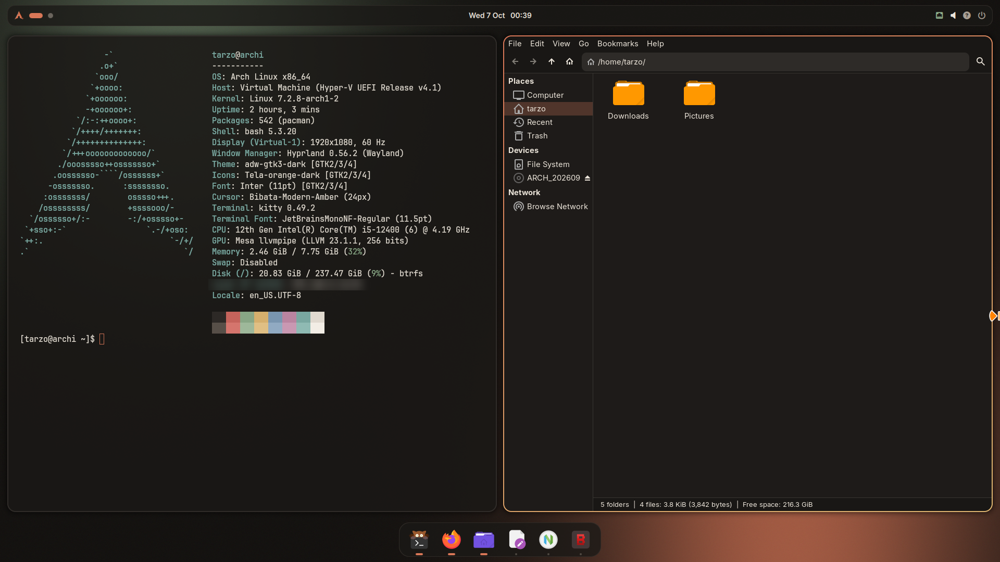
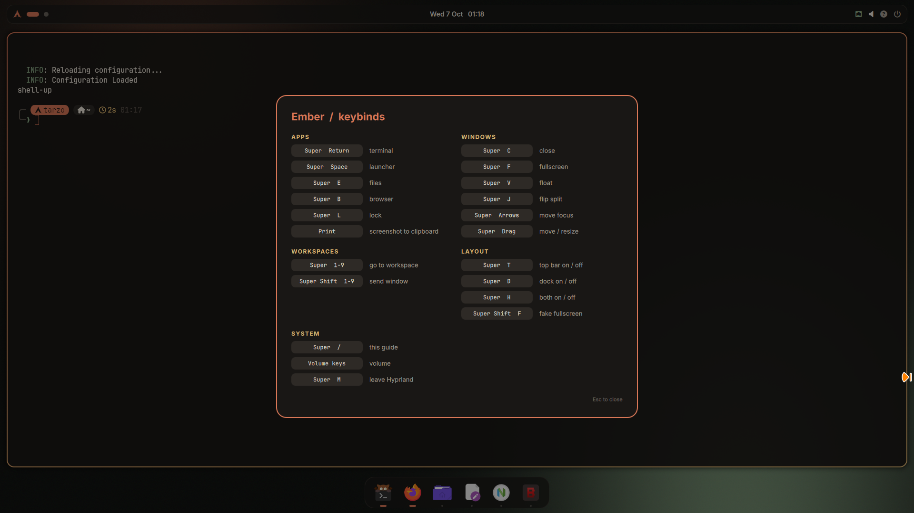
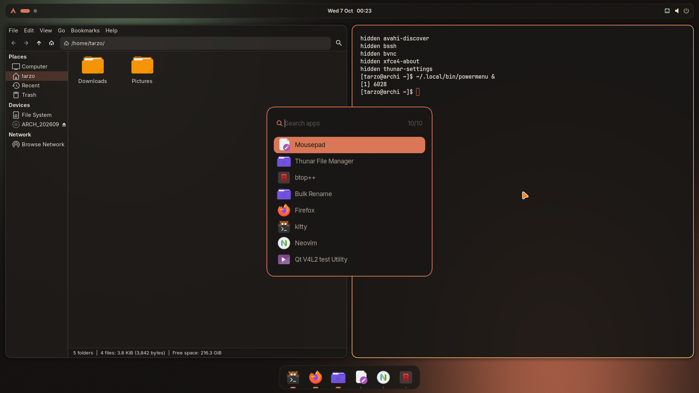
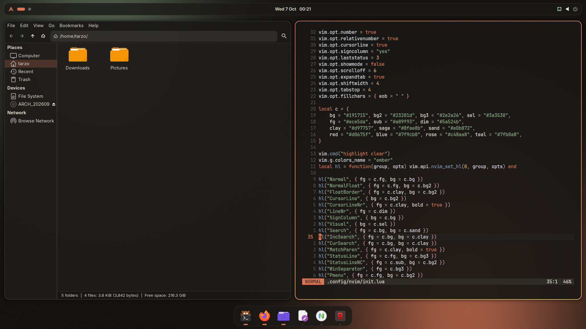
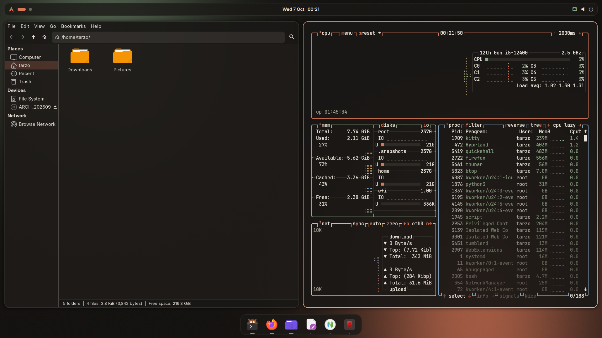
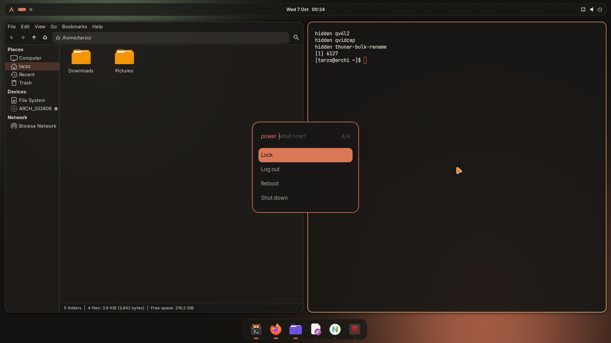
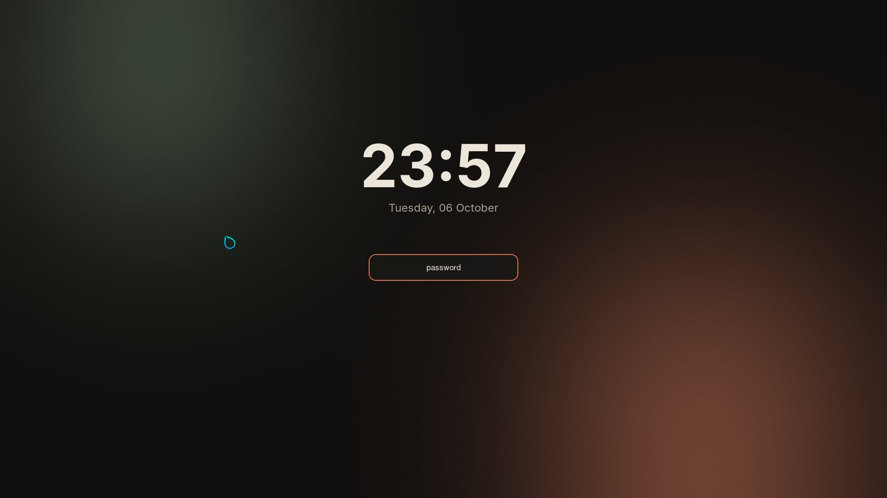
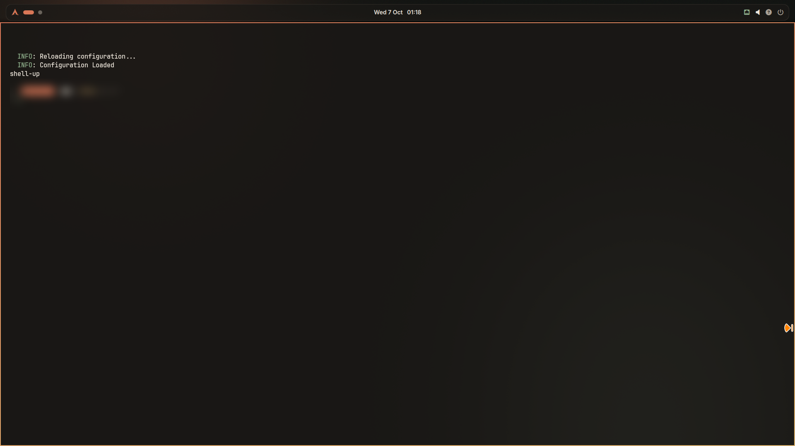

# Ember

**A Hyprland setup designed and typed in by Claude**, live, for the Tech Ressolve video
*Can AI Make My Hyprland Rice?* Warm charcoal, a clay accent, a little sage and sand.
Everything in it was written for Hyprland 0.56 and its new **Lua** config.



| | |
|---|---|
|  |  |
|  |  |
|  |  |
|  | |

## What's inside

| Part | Tool | Notes |
|---|---|---|
| Compositor | Hyprland 0.56 | `hyprland.lua`: gaps, clay-to-sand borders, blur, its own animation curve |
| Shell | [Quickshell](https://quickshell.org) | wallpaper, bar and dock in QML, one process |
| Bar | Quickshell | launcher button, workspace pills, clock, tray, network, volume (scroll to change), keybind guide, power |
| Dock | Quickshell | pinned apps with running indicators, hover zoom |
| Keybind guide | Quickshell | **Super + /** or the `?` in the bar |
| Panel toggles | Quickshell + Hyprland | hide the top bar, the dock, or both; **fake fullscreen** keeps the bar, drops the dock and takes windows edge to edge |
| Launcher | fuzzel | search glyph, clay selection bar, Tela icons; also drives the power menu |
| Notifications | mako | |
| Lock / idle | hyprlock, hypridle | locks after 10 minutes |
| Terminal | kitty | Ember palette, JetBrains Mono Nerd Font |
| Editor | Neovim | an Ember colour scheme and statusline, no plugins |
| Files, text | Thunar, Mousepad | adw-gtk3-dark recoloured through GTK named colours; Ember editor scheme |
| Monitor | btop | Ember theme |
| Icons, cursor | Tela orange, Bibata Modern Amber | |
| Wallpaper | ImageMagick | painted by the installer, no image files shipped |

## Install

Arch Linux, from inside a Hyprland session:

```bash
git clone https://github.com/tarzo-codes/ember-hyprland
cd ember-hyprland
./install.sh
```

The installer asks for sudo once (pacman), downloads Tela and Bibata from their GitHub
releases, and **backs up every file it replaces** to `~/.config/ember-backup-<date>/`.
Then log out and back in.

Your monitor: `~/.config/hypr/hyprland.lua` sets `scale = 1` because Hyprland's automatic scale
chose 2x on the 1080p VM this was built on. Change the `hl.monitor` line to match your screen.

## Keybinds

| Keys | Action |
|---|---|
| `Super` + `Return` / `Q` | terminal |
| `Super` + `Space` | launcher |
| `Super` + `E` | files |
| `Super` + `B` | browser |
| `Super` + `L` | lock |
| `Print` | screenshot an area to the clipboard |
| `Super` + `C` | close window |
| `Super` + `F` | fullscreen |
| `Super` + `V` | float |
| `Super` + `J` | flip split |
| `Super` + arrows | move focus |
| `Super` + drag (left / right) | move / resize |
| `Super` + `1`-`9` | go to workspace |
| `Super` + `Shift` + `1`-`9` | send window to workspace |
| `Super` + `T` | top bar on / off |
| `Super` + `D` | dock on / off |
| `Super` + `H` | both on / off |
| `Super` + `Shift` + `F` | fake fullscreen (bar stays, dock hides, no gaps) |
| `Super` + `/` | keybind guide |
| volume keys | volume |
| `Super` + `M` | leave Hyprland |

## Palette

| Name | Hex | Used for |
|---|---|---|
| base | `#191715` | backgrounds |
| overlay | `#2e2a26` | borders, inactive things |
| text | `#ece5da` | text |
| subtext | `#a89f93` | secondary text |
| clay | `#d97757` | the accent |
| sand | `#e0b872` | highlights, gradients |
| sage | `#8fae8b` | good states, strings |

## Notes from building it

- **hyprpaper 0.8 needs Wayland protocols a software-rendered VM doesn't offer**, so the
  wallpaper is a background layer drawn by Quickshell instead. One less daemon either way.
- The dock reads each window's Wayland app id; Hyprland's IPC info is empty for windows
  opened after the shell starts.
- Everything that types into Neovim through a virtual keyboard needs auto-indent and comment
  continuation off. That's a story for the video.

## Credits and licenses

The configs in this repo are MIT licensed (see `LICENSE`). The installer downloads, but does not
include, [Tela icon theme](https://github.com/vinceliuice/Tela-icon-theme) by vinceliuice and
[Bibata Cursor](https://github.com/ful1e5/Bibata_Cursor) by ful1e5, both GPL-3.0. Built on
[Hyprland](https://hypr.land), [Quickshell](https://quickshell.org),
[adw-gtk3](https://github.com/lassekongo83/adw-gtk3), fuzzel, mako and kitty.

Made for the Tech Ressolve YouTube channel.
